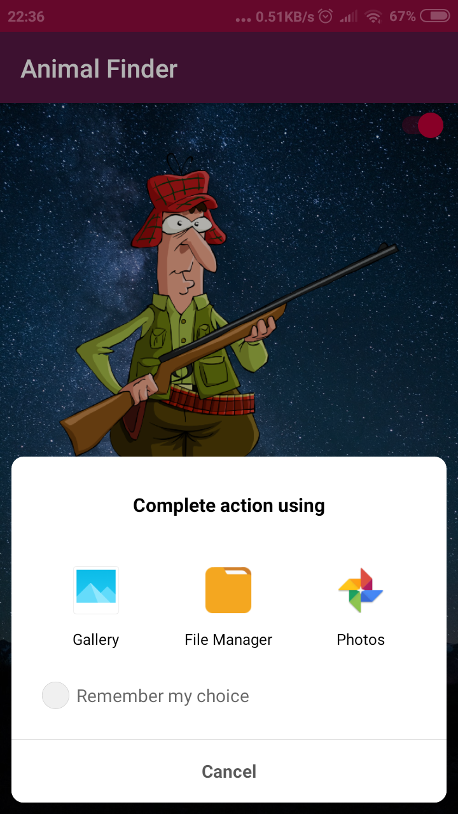
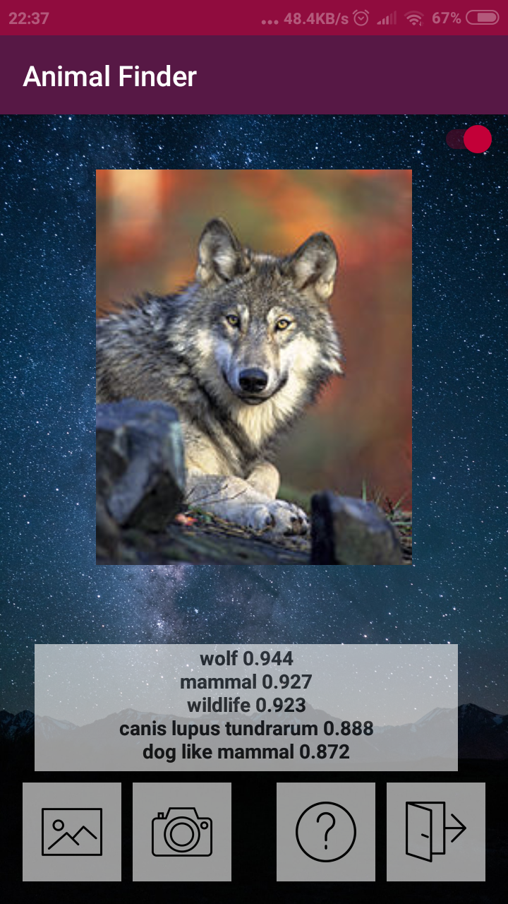
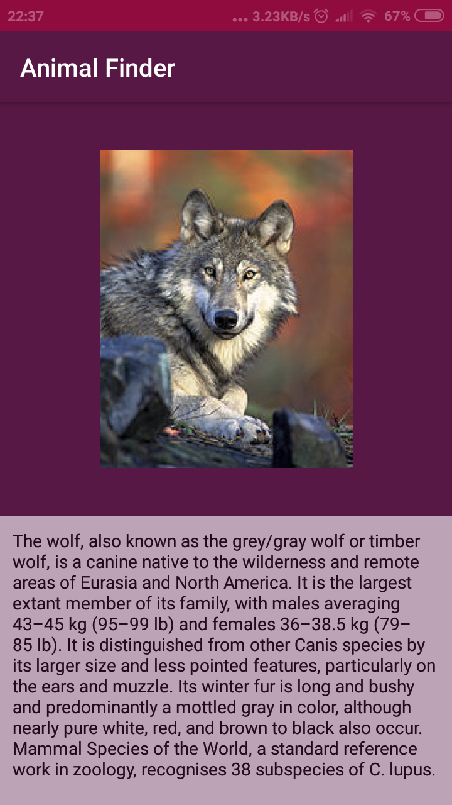
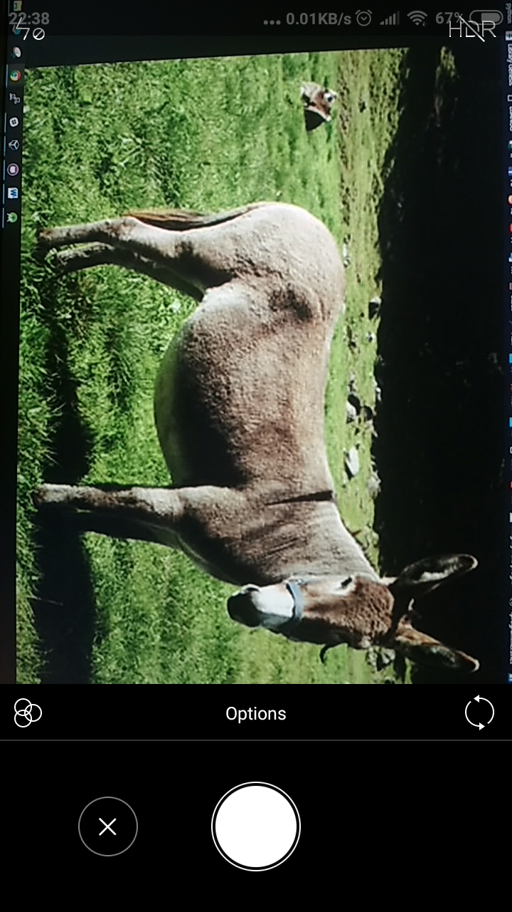
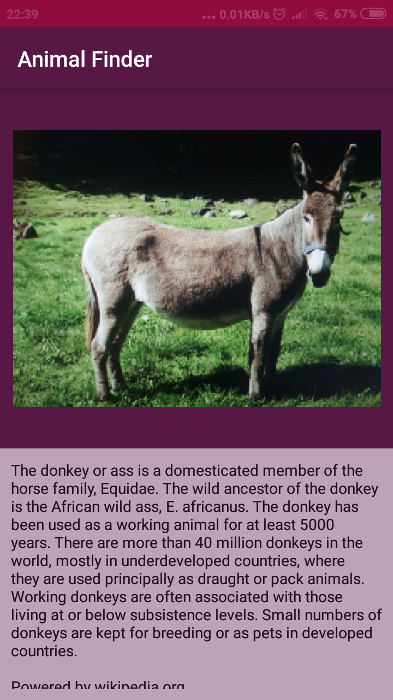
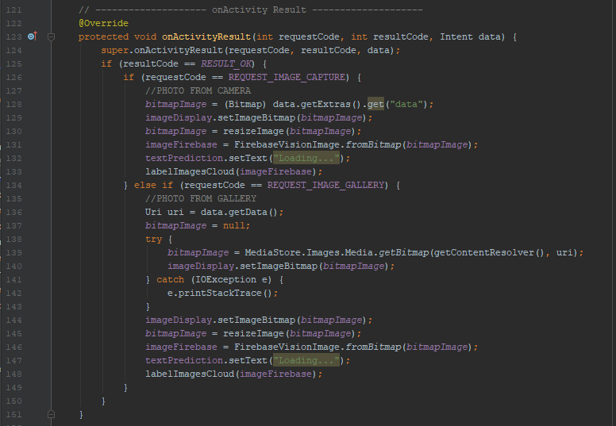
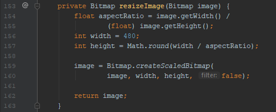
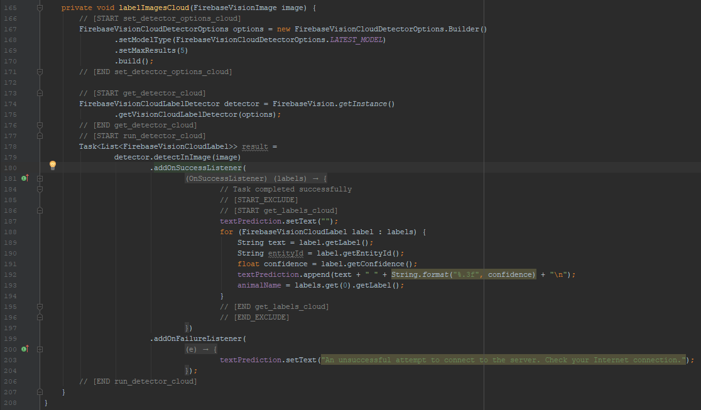

# Dokumentacja projektowa 
 
### Aplikacja wykorzystująca mechanizmy rozpoznawania obrazów.
 
# Spis treści

1. [Cel projektu](#cel-projektu)
2. [Opis projektu](#opis-projektu)
3. [Przykłady użycia aplikacji](#przykłady-użycia-aplikacji)
	- [Wybranie obrazu z galerii](#wybranie-obrazu-z-galerii)
	- [Wykonanie zdjęcia](#wykonanie-zdjęcia)
4. [Kod aplikacji](#kod-aplikacji)
	- [MainActivity.java](#mainactivityjava)
	- [AppSingleton.java](#appsingletonjava)
	- [Wikipedia.java](#wikipediajava)	
4. [Autorzy projektu](#autorzy-projektu)
5. [Licencja](#licencja)

# Cel projektu
Celem realizowanego projektu było stworzenie aplikacji wykorzystującej mechanizmy rozpoznawania obrazów oraz wyświetlenie opisu rozpoznanego obrazu. Mechanizmy zostały wykorzystane, do rozpoznawania m.in. wizerunków zwierząt.

# Opis projektu
Animal Finder to aplikacja wykorzystująca mechanizmy rozpoznawania obrazów. Jej zadaniem jest rozpoznanie obrazu oraz wyświetlenie opisu obrazu. Aplikacja została napisana za pomocą oprogramowania Android Studio wykorzystując platformę Firebase do tworzenia aplikacji mobilnych oraz ML Kit dla deweloperów - framework nauczania maszynowego(machine learning).

# Przykłady użycia aplikacji
Po uruchomieniu aplikacji przechodzimy do głównej aktywności, w której zostały umieszczone przyciski nawigacyjne, pozwalające na interakcję z aplikacją oraz pole tekstowe służące do wyświetlania wyników predykcji

   

- Przycisk galerii
  - pozwala na import obrazu z pamięci wewnętrznej telefonu
- Przycisk kamery
  - pozwala na zrobienie zdjęcia korzystając z aparatu w telefonie
- Przycisk informacji
  - pozwala na wyświetlenie opisu obrazu
- Przycisk zamykania aplikacji
  - pozwala na zamknięcie aplikacji
- Przycisk zmiany tła (switch prawy górny róg)
  - pozwala na zmianę tła w aplikacji

### Wybranie obrazu z galerii
- Wybieramy przycisk galerii, a następnie dokonujemy wyboru interesującego nas obrazu
   

- Na ekranie możemy zaobserwować wybrany przez nas obraz oraz wyniki predykcji dla rozpoznawanego przez nas obrazu. Wyniki posortowane są od najbardziej prawdopodobnych. Każdy wynik składa się z etykiety oraz przypisanej do niej wartości 
z przedziału 0.000 - 1.000 oznaczającej prawdopodobieństwo trafności wyniku.
   

- Wybieramy przycisk informacji - aplikacja przenosi nas do nowego widoku w którym znajduję się opis szukanego zwierzęcia dla najbardziej prawdopodobnego wyniku pobranego ze strony wikipedia.org
   

### Wykonanie zdjęcia
- Wybieramy przycisk zrób zdjęcie - aplikacja pozwala nam na wykonanie zdjęcia wykorzystując nasz aparat w telefonie. Na screenie możemy zaobserwować zrobione przez nas zdjęcie
   

- Na ekranie możemy zaobserwować wybrany przez nas obraz oraz wyniki predykcji dla rozpoznawanego przez nas obrazu. Wyniki posortowane są od najbardziej prawdopodobnych. Każdy wynik składa się z etykiety oraz przypisanej do niej wartości 
z przedziału 0.000 - 1.000 oznaczającej prawdopodobieństwo trafności wyniku.
   

- Wybieramy przycisk informacji - aplikacja przenosi nas do nowego widoku w którym znajduję się opis szukanego zwierzęcia dla najbardziej prawdopodobnego wyniku pobranego ze strony wikipedia.org
   

# Kod aplikacji
Stworzona przez nas aplikacja posiada dwa główne widoki activity_main.xml(domyślny widok po uruchomieniu aplikacji) oraz activity_wikipedia.xml(widok odpowiedzialny za wyświetlanie opisu zwierzęcia). Klasy obsługujące aplikacje to AppSingleton.java, Wikipedia.java, MainActivity.java.

### MainActivity.java
Klasa odpowiada za przechwycenie zdjęcia od użytkownika, zmianę jego rozmiaru oraz jego rozpoznanie.
- Przechwycenie zdjęcia użytkownika
Realizowane jest w funkcji onActivityResult(). Przechwycony obraz konwertowany jest na BitMapę, która później wykorzystywana jest do utworzenia obiektu typu FirebaseVisionImage. Obraz przechowywany 
w takim obiekcie wymagany jest przez detektor znajdujący się chmurze Google pozwalający na rozpoznanie obrazu.
   

- Zmiana rozmiaru zdjęcia
Realizowana jest w funkcji resizeImage(). Funkcja jest wykorzystywana, aby uniknąć problemu z przepełnieniem buforu podczas przekazywania go do aktywności wikipedia. Obraz zmniejszany jest wraz 
z zachowaniem jego proporcji. Najpierw ustalamy współczynnik proporcji, 
a następnie skalujemy go przy użyciu metody createScaledBitmap().
   

- Rozpoznanie obrazu
Realizowane jest w funkcji labelImagesCloud(). Funkcja przyjmuje jako parametr obiekt typu FirebaseVisionImage, który przechowuje wybrane przez nas zdjęcie. Najpierw tworzymy opcje konfiguracyjne etykiet obrazu wykorzystywane przez nasz detektor tj. wykorzystywany model do rozpoznawania obrazów oraz ilość wygenerowanych wyników predykcji. Następnie tworzymy instancję klasy FirebaseVisionCloudLabelDetector zawierającą nasze ustawienia konfiguracyjne. Kolejny krok to utworzenie Task, pozwalającego na wykonanie zadania przez naszą aplikację, główna aktywność naszej aplikacji pojawia się w stosie na pierwszym miejscu. Wewnątrz zadania uruchamiany jest nasz detektor, który po pomyślnym rozpoznaniu obrazu wypisuje wyniki predykcji wraz z ich nazwami w naszym textArea(textPrediction). W przypadku niepowodzenia(błąd połączenia 
z API) wyświetlany jest komunikat o błędzie.
   

### AppSingleton.java
Klasa wykorzystująca bibliotekę volley - która odpowiada za wszystko co ma związek z żądaniami sieciowymi w androidzie. Automatycznie planuje zadania takie jak np. pobieranie odpowiedzi z sieci, zapewnia ona przezroczyste buforowanie pamięci. Wykorzystujemy ją do pobrania obiektu json w klasie Wikipedia.java
Nazwaliśmy ją Singleton ponieważ pozwala na utworzenie tylko jednej instancji i uzyskaniu dostępu do tej utworzonej.

### Wikipedia.java
Klasa odpowiadająca za pobranie informacji o zwierzęciu przekazanego z MainActivity. Informacje pobieramy w formacie json dzięki api dostępnego na wikipedia.org, a następnie wyciągamy opis z obiektu json w postaci tekstu i wyświetlamy go w naszej aktywności.
Realizowane jest to wykorzystując AppSingleton - pobieramy jej instancje i dodajemy do kolejki żądań wcześniej utworzony obiekt jsonObjectReq, w którym jako parametr podajemy adres url i oczekujemy 
w nim na odpowiedź od api wikipedii. Jest tu realizowana obsługa błędów 
w przypadku gdy nie będzie informacji o szukanym zwierzęciu lub nie będziemy mieć połączenia z internetem. W pomyślnym przypadku pobrania informacji w formacie json, za pomocą response.getString("extract") pobieramy tekst z etykiety extract, w którym znajduję się nasz pożądany opis. Następnie wyświetlamy go w rozwijanym polu tekstowym.
   

### Autorzy projektu
- Paweł Fiołek
- Alan Biały

### Licencja
MIT licence.
